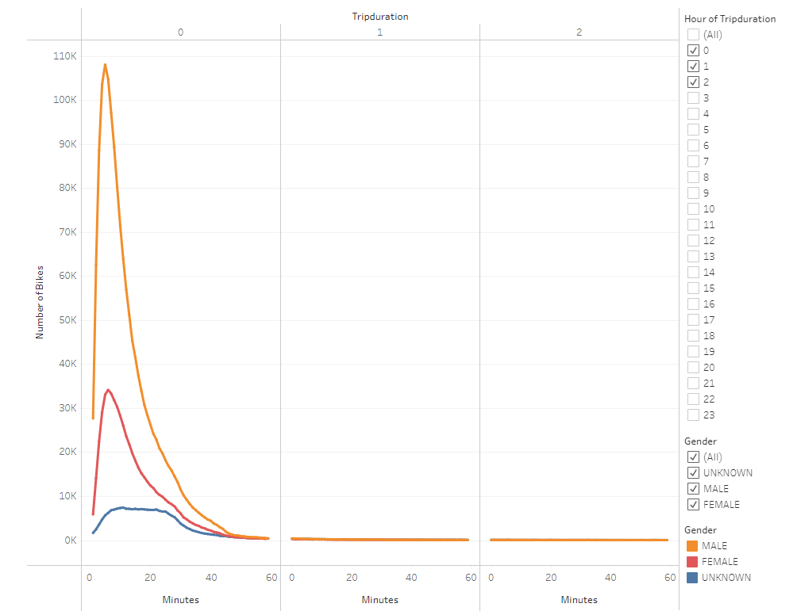
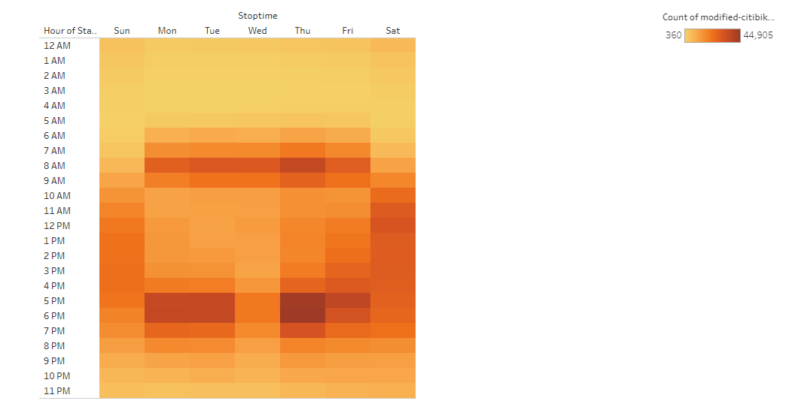
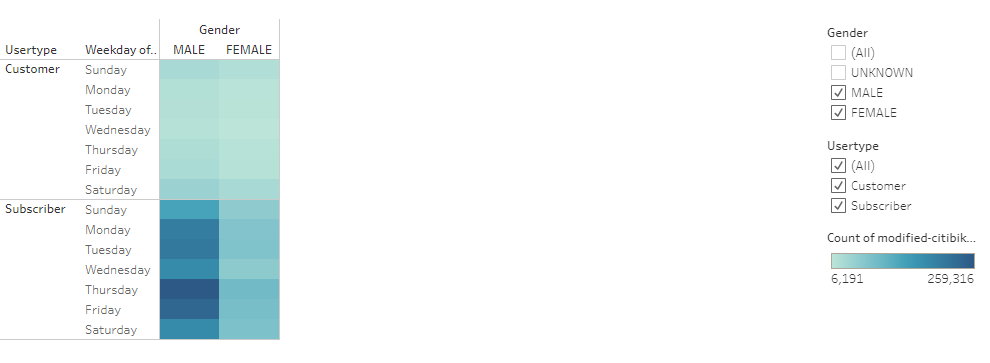
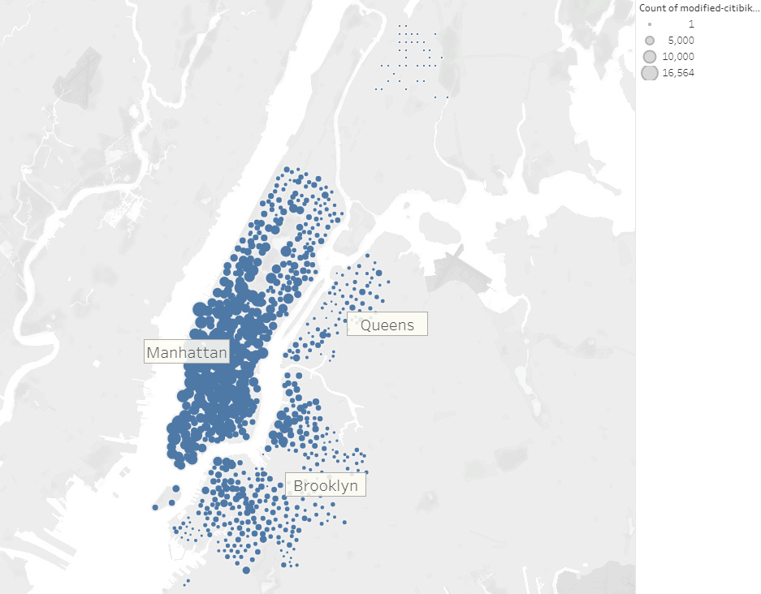
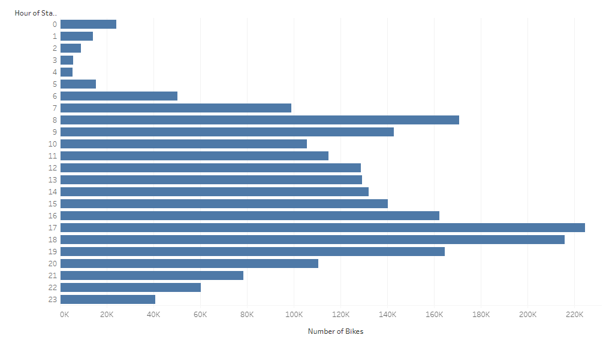

# Bikesharing
## Overview of the Analysis
Data aquired from Citi Bike New York was analysed for use as a model in the creation of a potential bikesharing company in Des Moines, Iowa.  Data from the entire month of August, 2019 was downloaded from the Citi Bike System Data web site and an analysis of it was performed in Tableau.  Included in the data file was information from each individual bike ride about trip duration, starting and ending location, member or casual rider, and gender of the rider.  This data was organized and filtered in Tableau and used to create visualizations to determine the length of time that bikes are checked out for all riders and genders, the number of bike trips for all riders and genders for each hour of each day of the week, the number of bike trips for each type of user and gender for each day of the week, and lastly a map of where bikes are most often checked out.  The finished Tableau story can be viewed via the link below.  

[link to NY Citi Bike August 2019 Analysis dashboard](https://public.tableau.com/app/profile/eric.himburg/viz/NYCitiBikeAnalysis_16490108119270/NYCitiBikeAnalysis)

## How Citi Bike Works in New York
Citi Bike bikes can be found at hundreds of stations around Manhattan, Brooklyn, Queens, the Bronx, and Jersey City. Using the Citi Bike app, available bikes and their station locations can be found.  In order to use the bike, a rider must have a day pass or an annual membership. A code is used to unlock the bike and start the ride and rides are considered finished when the bike is returned to a station.

## Results
The first visualization in our Tableau story can be seen below and displays the number of bikes versus trip duration.  From the peak of the graph we learn that most bike trips last about 5 minutes long.  The number of bikes versus trip duration also shows that there are very few rides that ever last longer than 1 hour.  

The second visualization shown below displays the number of bikes versus trip duration separated by gender.  It clearly indicates that the majority of bike riders are male and that men are more than 3 times as likely to be the riders versus women.  

The third visualization is a heat map which shows the amount of rides which occur in a given hour on a given day.  From it we learn that during the week bike rides occur around 8 am or 5 pm and that one the weekends bike rides start around noon.

The fourth visualization is a heat map which shows the amount of rides which occur in a given hour on a given day broken down by gender.  It shows that both men and women use the bikes on weekdays during 8 am/5pm and on weekends at 12 pm.  

The fifth visualization breaks down the number of riders per day and separates them by subscriber status and also gender.  From it we learn that most of the individuals using the bikes are subscribers.  The subscribers use the bikes the most on Thursdays and overall use them more on the weekdays than the weekends.  Short-term customers are more likely to use the bikes on a weekend.    

The sixth visualization is a geographical bubble map which shows a count of the number of rides in August.  From this it can be seen that bike rides are more likely in certain boroughs of New York. In particular, ridesharing is popular in Manhattan.        

The seventh visualation is a bar graph of the hourly start time of the bike rides versus the number of rides which occurred.  From this graph we learn that most bike rides start around 5-6 pm and the least amount of bike rides start around 3-4 am.  

## Summary
From the results above we have learned that in the month of August most of the Citi Bike riders are male subscribers who use the bike during 8am or 5 pm during weekdays and around noon on the weekends.  It is hypothesized that the bikes are used to commute to and from work on weekdays and used recreationally on the weekends.  Additionally, it was found that the amount of bike use was the least on Sundays.  It was discovered that subscribers are more likely to use the bikes on weekdays and non-subscribers on the weekends.  Additionally, most the rides originated from Manhattan or in areas of boroughs that border Manhattan.  When looking at all of the bikesharing data for the month of August most rides occur on Thursday and begin around 5 pm.  Lastly, it was found that the least amount of rides originate between 3-4 am and hence this time period would be a useful time to perform bike maintenance.  

In order to improve this analysis, it is suggested that two other visualizations be created.  The first visualization should plot the number of bike rides per month.  The current analysis only looks at data from a peak month, August, and it would be interesting to see if bike use changes in winter months.  A second visualization that would be useful is to see start location versus stop location for a given trip.  In particular, do most bikes end up where they started?  Given the popularity of certain start locations it may be necessary to move bikes from one station to another to accommodate customer needs.  

