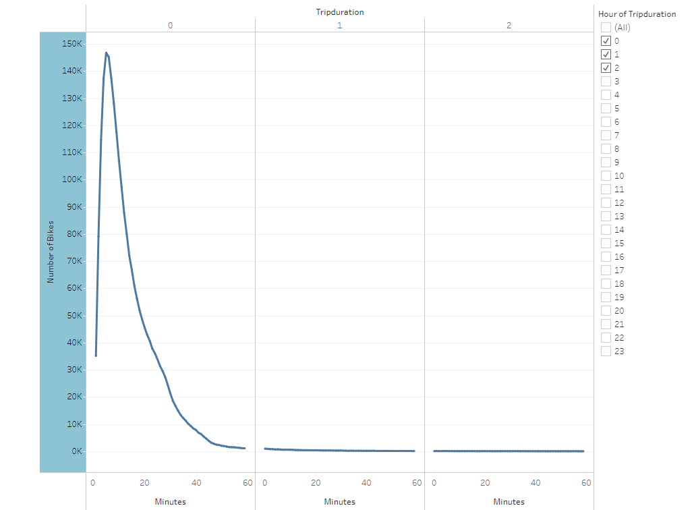

# Bikesharing
## Overview of the Analysis
Data aquired from Citi Bike New York was analysed for use as a model in the creation of a potential bikesharing company in Des Moines, Iowa.  Data from the entire month of August, 2019 was downloaded from the Citi Bike System Data web site and an analysis of it was performed in Tableau.  Included in the data file was information from each individual bike ride about trip duration, starting and ending location, member or casual rider, and gender of the rider.  This data was organized and filtered in Tableau and used to create visualizations to determine the length of time that bikes are checked out for all riders and genders, the number of bike trips for all riders and genders for each hour of each day of the week, the number of bike trips for each type of user and gender for each day of the week, and lastly a map of where bikes are most often checked out.  The finished Tableau story can be viewed via the link below.  

[link to NY Citi Bike August 2019 Analysis dashboard](https://public.tableau.com/app/profile/eric.himburg/viz/NYCitiBikeAnalysis_16490108119270/NYCitiBikeAnalysis)

## How Citibike Works in New York
Using a Citi Bike app Pick up a bike at one of hundreds of stations around Manhattan, Brooklyn, Queens, the Bronx, and Jersey City. See bike availability on the Station Map or mobile app.  Take as many short rides as you want while your pass is active. Day Passes include unlimited 30-min rides and Annual Memberships include unlimited 45-min rides on a classic Citi Bike.  End a ride by returning your bike to any station. Slide your bike firmly into an empty dock and wait for the green light to make sure it's locked.

## Results
Slide 1...

## Summary
A well-organized, good-looking visual...   
